# Monitoring-AWS-Secrets-Manager-Access

## Project Overview
This hands-on project demonstrates how to monitor access to AWS Secrets Manager by combining AWS CloudTrail, CloudWatch, and Amazon SNS. The project implements the principle of least privilege using IAM policies, validates permissions with AWS CLI, and automatically sends email notifications whenever secret access events are detected.

Throughout the project, two IAM users are used to simulate real-world scenarios:

- Developer – Authorized to retrieve secrets.
- Intern – Unauthorized user used to validate access control and monitoring.

The monitoring workflow records API activity through CloudTrail, forwards logs to CloudWatch Logs, evaluates specific events using Metric Filters, triggers CloudWatch Alarms, and delivers notifications via Amazon SNS.

## Architecture Diagram

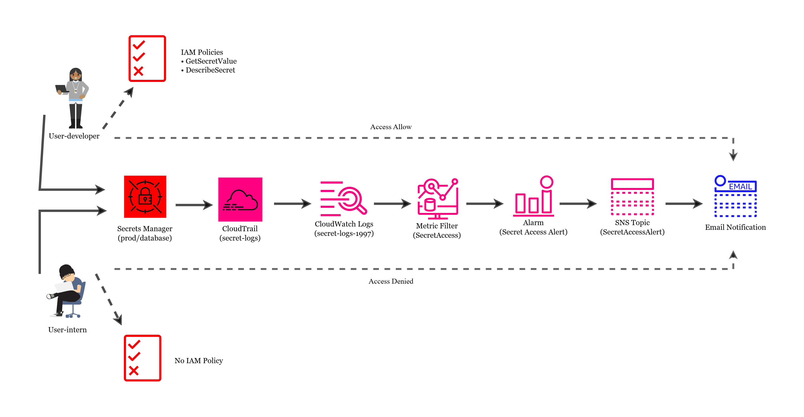

## Prerequisites
Before starting this project, ensure you have:
- An active AWS Account
- Basic understanding of AWS IAM
- AWS CLI installed
- A verified email address for Amazon SNS notifications
- AWS CloudShell or Windows PowerShell
- Basic knowledge of AWS CloudTrail and CloudWatch

# Phase 1 – Create and Manage Secrets
## Step 1 – Create the First Secret
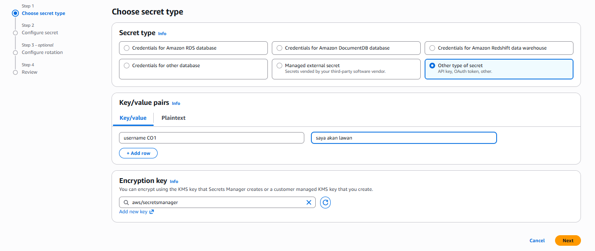
Create your first secret in AWS Secrets Manager using the Other type of secret option. Store the secret as a key-value pair and assign a meaningful name such as prod/database. This secret will represent a production database credential used later for access validation and monitoring.

## Step 2 – Create Multiple Production Secrets
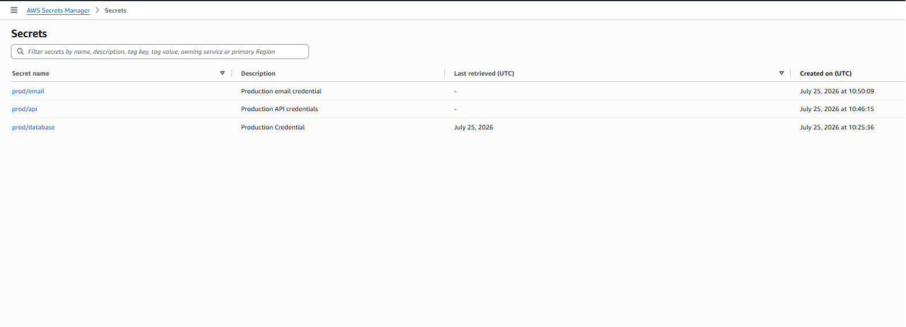
Using separate secrets for different services follows the principle of least privilege, allowing each application or user to access only the specific secrets they require.

## Step 3 – Verify Secret Configuration
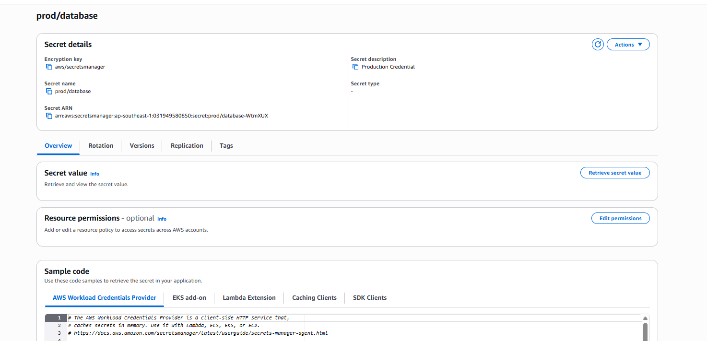
Review the secret configuration to verify that it has been created successfully. Confirm the secret name, encryption settings, resource ARN, and current version before proceeding to the IAM configuration phase.

# Phase 2 – Configure IAM Access Control
Objective

In this phase, we implement the principle of least privilege by creating IAM users with different permission levels. A custom IAM policy is used to grant only the minimum permissions required to access specific secrets in AWS Secrets Manager.

## Step 1 – Create IAM Users
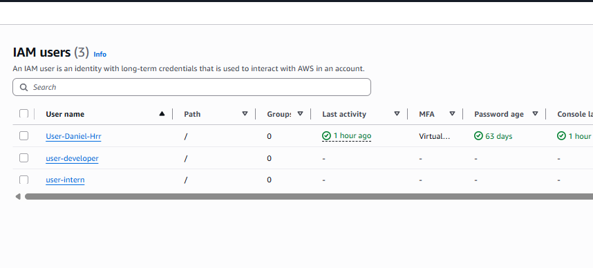

Create two IAM users to simulate different access scenarios:

- user-developer – Authorized to retrieve secrets.
- user-intern – No permissions assigned.

These users will be used to validate both authorized and unauthorized access throughout the project.

## Step 2 – Create a Customer Managed IAM Policy
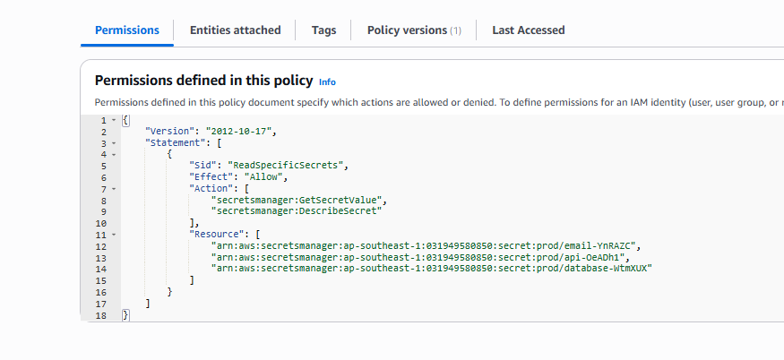

Create a customer managed IAM policy that allows only the required Secrets Manager actions:

- secretsmanager:GetSecretValue
- secretsmanager:DescribeSecret

Limit the policy to the specific secrets created in Phase 1. This follows the principle of least privilege by granting access only to the required resources and actions.

## Step 3 – Attach the Policy to the Developer User
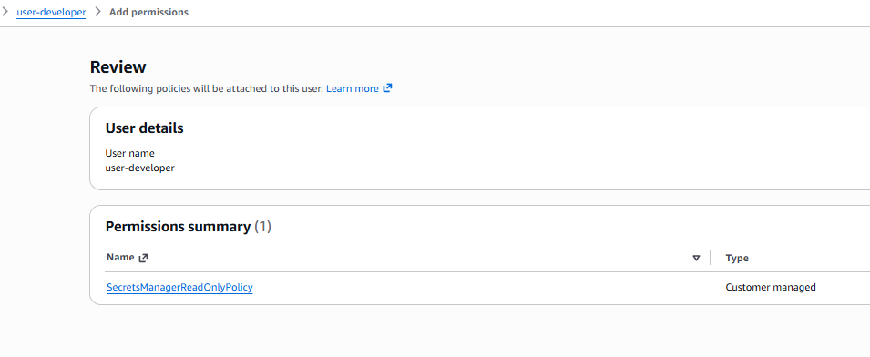

Attach the custom IAM policy only to user-developer. Leave user-intern without any Secrets Manager permissions to simulate an unauthorized user during the testing phase.

## Step 4 – Create Access Keys for AWS CLI
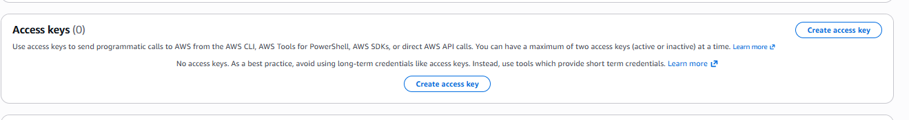

Download the .csv file

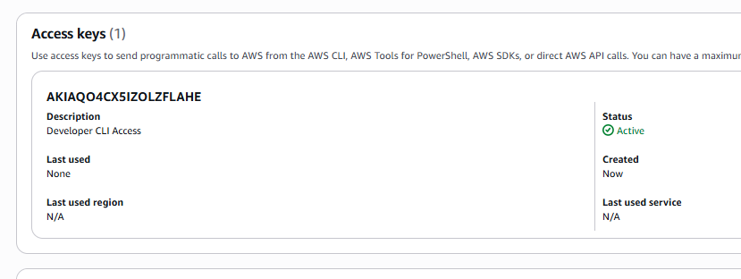

# Phase 3 – Validate Secret Access Using AWS CLI
Objective

In this phase, AWS CLI is used to validate IAM permissions by testing secret access with different IAM users. The tests demonstrate how the principle of least privilege controls access to AWS Secrets Manager.

## Step 1 – Install and Configure AWS CLI
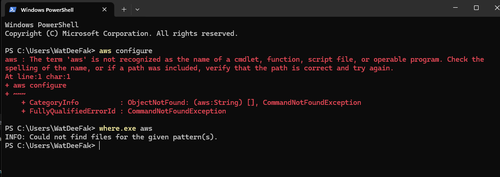

Download CLI

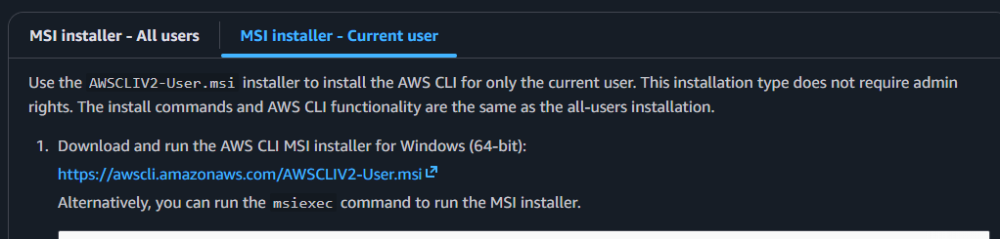

Installing

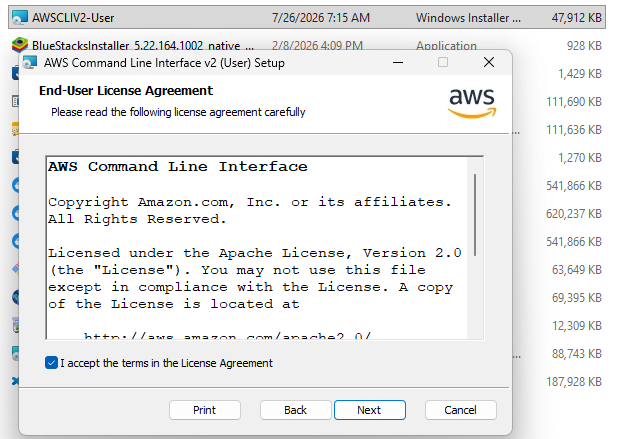

Test aws --version

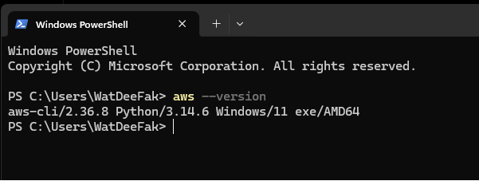

## Step 2 – Login to user-developer using access key
type aws configure, and then login with access key that we just created
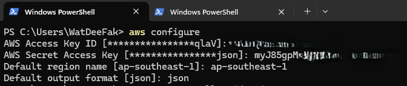
## Step 3 - Verify Developer Identity
type aws sts get caller identity, make sure which user we login
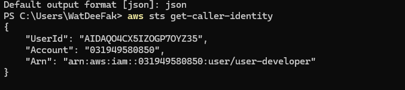
## Step 4 - Test Authorized Secret Access
type aws secretsmanager getsecretvalue secret id prod/database
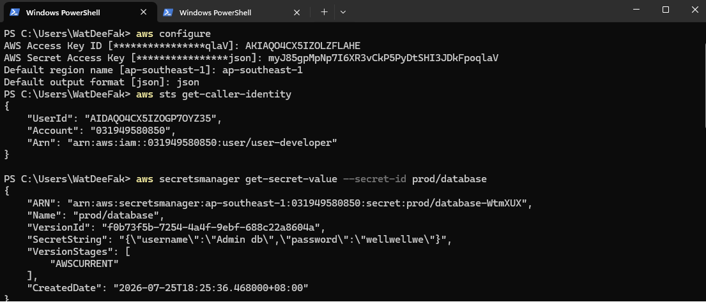
## Step 5 - Configure AWS CLI for the Intern User
now, we try to login with user-intern
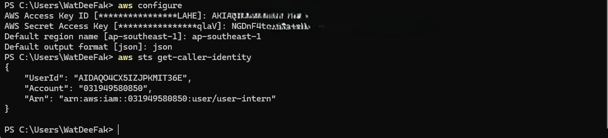
## Step 6 - Test Unauthorized Secret Access
try to getsecretvalue
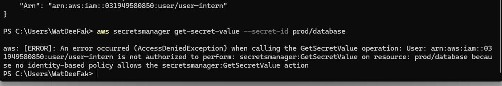
## Step 7 - Validate Least Privilege
and if we trying to list-secret, both user having 'Access Denied', in security world, you dont have to see full list of secret, if you have specific secret to open
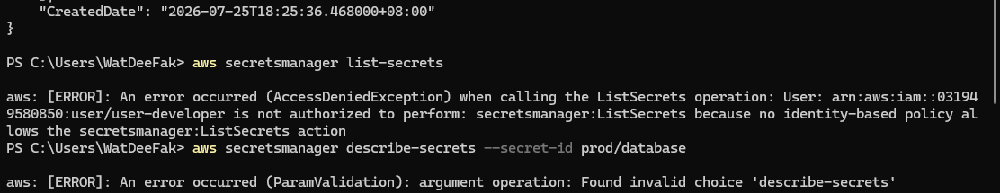
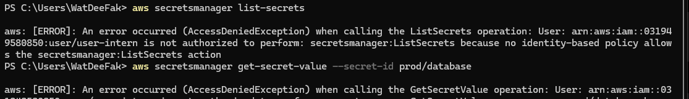

# Phase 4 – Configure Secret Access Monitoring
Objective

In this phase, we build an automated monitoring workflow to detect AWS Secrets Manager access events. AWS CloudTrail records API activity, CloudWatch Logs stores the events, Metric Filters identify specific actions, CloudWatch Alarms evaluate the metrics, and Amazon SNS sends email notifications.

## Step 1 – Create an AWS CloudTrail Trail
Create new S3 bucket → Log file SSE-KMS encryption(enable) → Log file validation(enable) → SNS notification(disable) → CloudWatch Logs(enable)
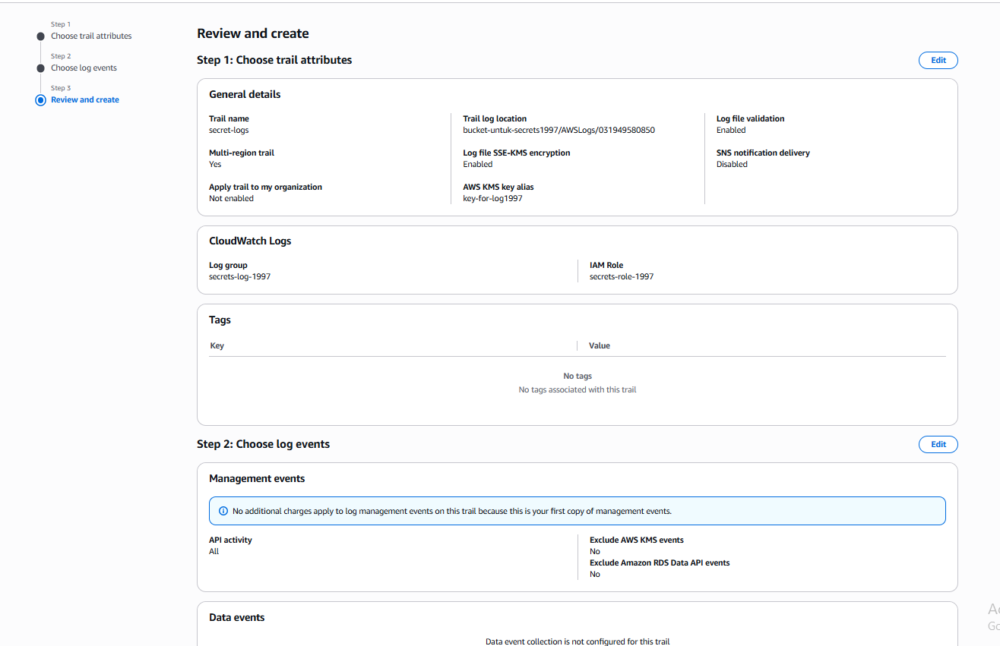
Create a multi-Region CloudTrail trail to record AWS API activity. Enable CloudWatch Logs integration to allow CloudTrail events to be analyzed by CloudWatch Metric Filters.
## Step 2 Configure Amazon SNS Notifications
Amazon SNS → Create topic → Standart → Create topic

Subcription → Protocol(Email)
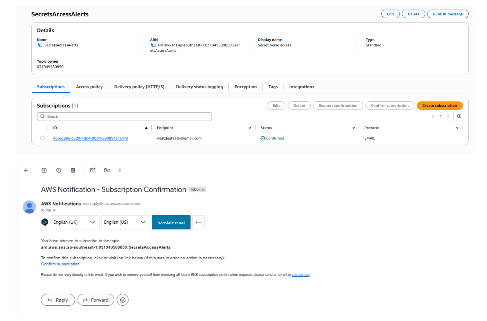
Create an Amazon SNS topic and subscribe an email address to receive alarm notifications. Confirm the email subscription before proceeding with the validation tests.
## Step 3 – Create a CloudWatch Metric Filter
CloudWatch → Log Management → Choose Metric filters tab → Create Metric → and pattern should be "$.eventName=..."
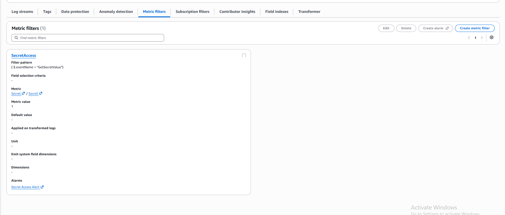
Whenever this event is detected, CloudWatch publishes a custom metric that can be evaluated by a CloudWatch Alarm.
## Step 4 – Create a CloudWatch Alarm
CloudWatch → Log Management → Choose Metric filters tab → Enable/Check metric that we just created → Create alarm

Data source(Metric) → Type(Classic) → Statistic(Sum) → Period(1 minute) → Threshold type(static) → Whenever Secret is...(Greater/Equal) → than type 1
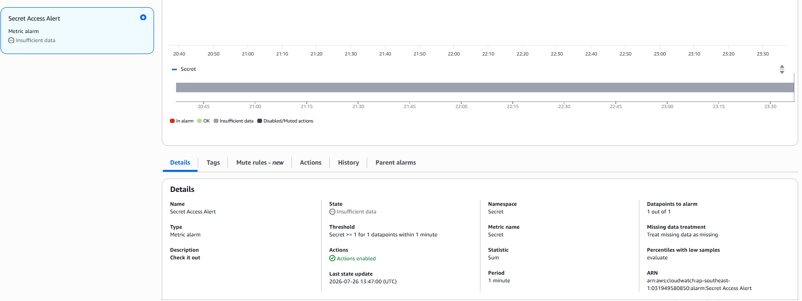
Create a CloudWatch Alarm that monitors the custom metric generated by the Metric Filter. Configure the alarm to trigger whenever one or more GetSecretValue events are detected within the evaluation period.
## Step 5 – Verify the Monitoring Configuration
Review the monitoring components to ensure they are properly connected before testing the complete workflow in the next phase.

Verify that:
- CloudTrail is logging API events.
- CloudWatch Logs is receiving CloudTrail logs.
- The Metric Filter is configured correctly.
- The CloudWatch Alarm is in the OK or Insufficient Data state.
- The SNS subscription has been confirmed.
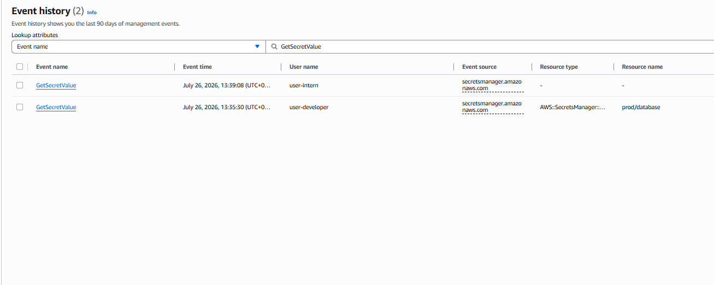
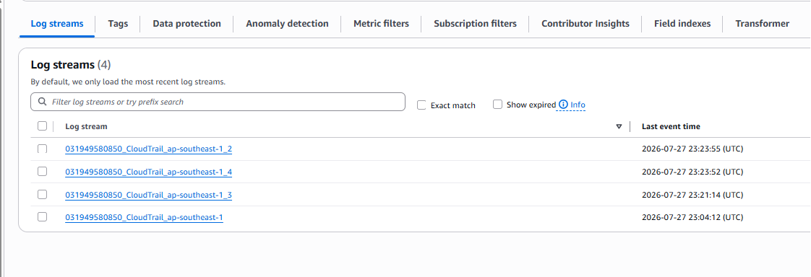
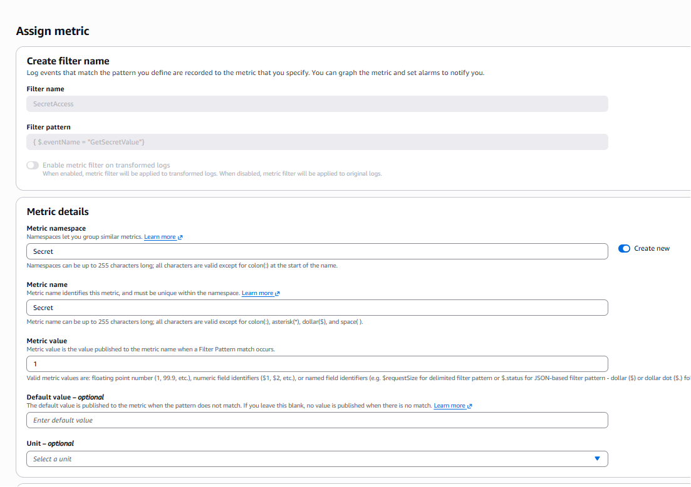

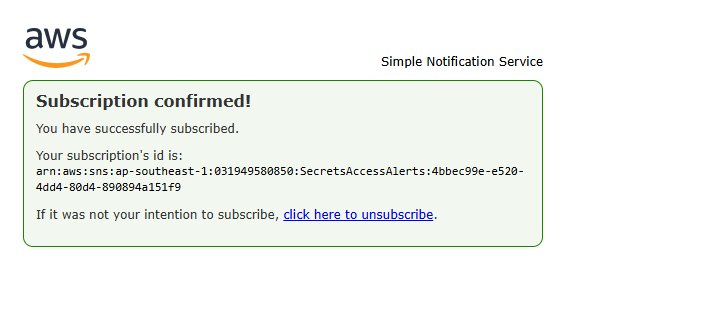

# Phase 5 Validate the Monitoring Workflow
Objective

In this phase, we validate the complete monitoring pipeline by generating real AWS Secrets Manager API events. The tests confirm that CloudTrail records the activity, CloudWatch detects the event, CloudWatch Alarm changes state, and Amazon SNS successfully sends an email notification.

## Step 1 – Generate a Secret Access Event
Retrieve one of the secrets using the user-developer account. aws secretsmanager get-secret-value --secret-id prod/database

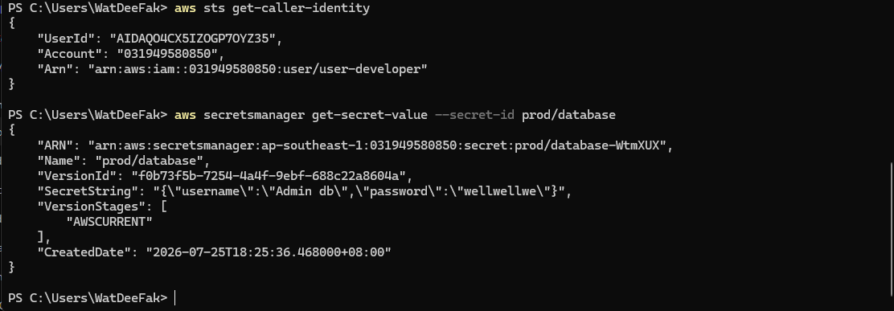
This generates a GetSecretValue API event that will be recorded by AWS CloudTrail.
## Step 2 – Verify CloudTrail Logs
Open CloudTrail Event History and verify that the GetSecretValue event has been successfully recorded.

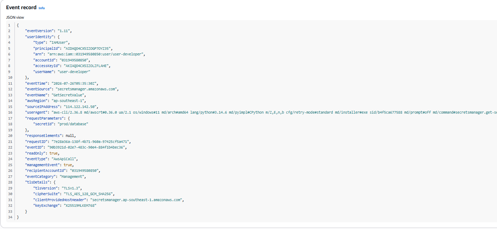
This confirms that AWS CloudTrail is capturing Secrets Manager API activity before forwarding the logs to CloudWatch Logs.
## Step 3 – Verify CloudWatch Alarm
After CloudWatch Logs processes the event, the Metric Filter publishes a custom metric.

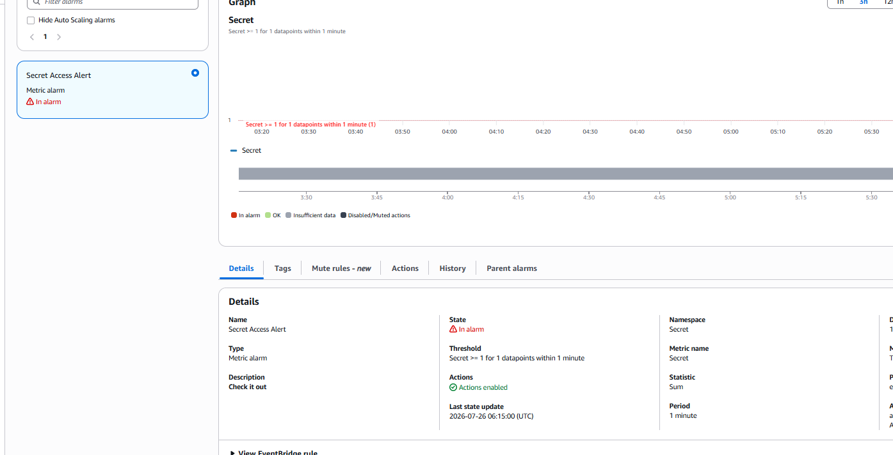
CloudWatch Alarm evaluates the metric and changes its state from OK (or Insufficient Data) to ALARM, indicating that a secret access event has been detected.
## Step 4 – Verify Amazon SNS Notification
Once the alarm enters the ALARM state, Amazon SNS sends an email notification to the subscribed recipient.

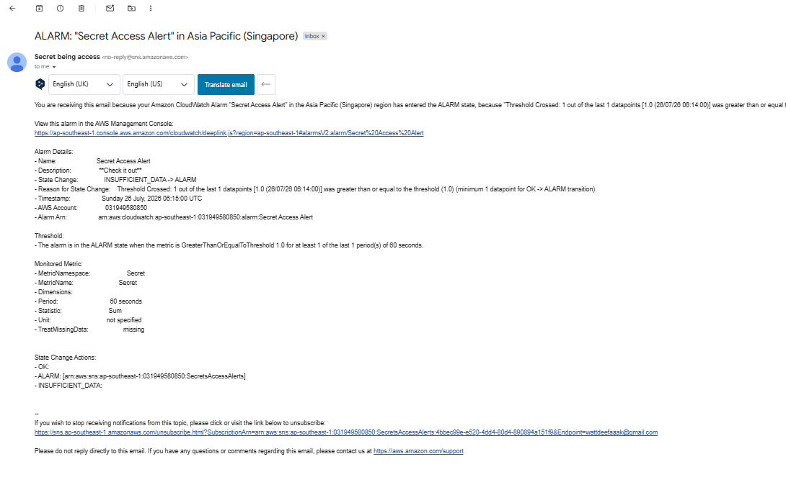
Receiving the email confirms that the monitoring workflow is functioning correctly from end to end.

## Skills Demonstrated

This project demonstrates several core Cloud Security and AWS operational skills, including:

- AWS Secrets Manager
- Identity and Access Management (IAM)
- Principle of Least Privilege
- AWS CLI
- AWS CloudTrail
- Amazon CloudWatch Logs
- CloudWatch Metric Filters
- CloudWatch Alarms
- Amazon SNS
- Security Monitoring
- Audit Logging
- Incident Detection
- Security Concepts

## This project applies several fundamental cloud security principles:

- Least Privilege – Restrict access to only the required Secrets Manager actions.
- Secrets Management – Store sensitive credentials securely instead of embedding them in applications.
- Audit Logging – Record all Secrets Manager API activity using AWS CloudTrail. AWS records Secrets Manager API calls in CloudTrail, enabling investigation and audit of secret access.
- Security Monitoring – Detect secret access events using CloudWatch Metric Filters and Alarms.
- Automated Notification – Notify security teams automatically through Amazon SNS whenever monitored events occur.

## Conclusion

This project demonstrates how AWS native security services can be integrated to improve the visibility of sensitive credential access. By combining AWS Secrets Manager, IAM, CloudTrail, CloudWatch, and Amazon SNS, organizations can implement an automated monitoring workflow that strengthens auditability, supports security operations, and enables faster detection of potentially sensitive activities. AWS itself documents CloudTrail, CloudWatch, and SNS as core building blocks for monitoring Secrets Manager activity.

